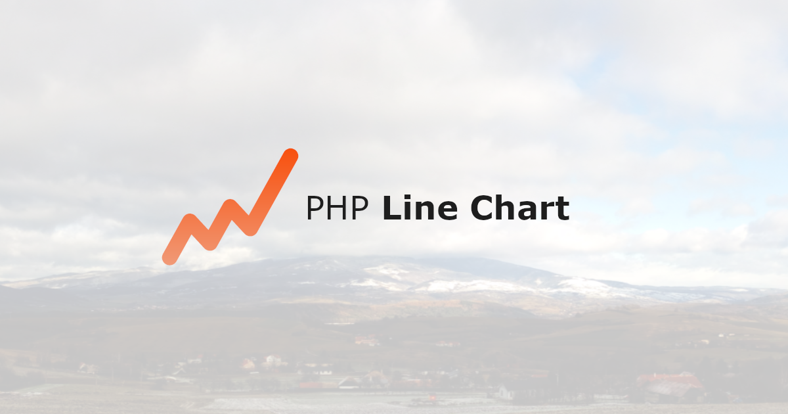
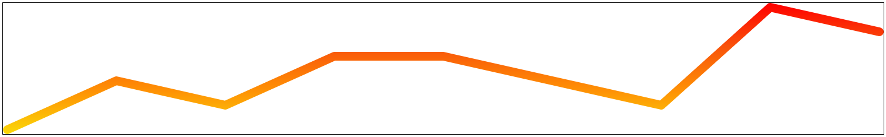
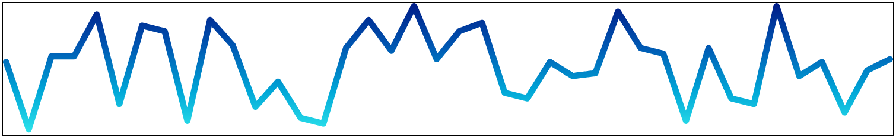

<p align="center"></p>

# Generates a simple line chart in SVG format using PHP

[](https://packagist.org/packages/ondrej-vrto/php-linechart)
[](https://github.com/OndrejVrto/php-linechart/blob/main/.github/workflows/run-tests.yml)
[](https://packagist.org/packages/ondrej-vrto/php-linechart)

## Installation

You can install the package via composer:

```bash
composer require ondrej-vrto/php-linechart
```

## Usage

```php
$data = [0, 2, 1, 3, 3, 2, 1, 5, 4];

$svg = LineChart::new($data)->make();
```

Creates the following svg string

```xml
<svg viewBox="0 0 200 30" width="200" preserveAspectRatio="none" xmlns="http://www.w3.org/2000/svg">
    <defs>
        <linearGradient x2="0" y1="1" id="color-44dac552-0a1b-4b31-9c35-8bda05443b6f">
            <stop stop-color="#fbd808" offset="0"></stop>
            <stop stop-color="#ff9005" offset="0.34"></stop>
            <stop stop-color="#f9530b" offset="0.67"></stop>
            <stop stop-color="#ff0000" offset="1"></stop>
        </linearGradient>
        <mask id="linechart-44dac552-0a1b-4b31-9c35-8bda05443b6f">
            <polyline
                stroke="#fff"
                stroke-width="2"
                fill="transparent"
                stroke-linecap="round"
                stroke-linejoin="round"
                vector-effect="non-scaling-stroke"
                transform="scale(24.75 -5.6) translate(0.0404 -5.1786)"
                points="0 0 1 2 2 1 3 3 4 3 5 2 6 1 7 5 8 4">
            </polyline>
        </mask>
    </defs>
    <g>
        <rect
            width="200"
            height="30"
            fill="url(#color-44dac552-0a1b-4b31-9c35-8bda05443b6f)"
            mask="url(#linechart-44dac552-0a1b-4b31-9c35-8bda05443b6f)"
        />
    </g>
</svg>
```
The generated svg looks like this.



## Input data types
```php
$data = [0, 1, 2, 3];          // integers
$data = [0.12, 1.5555, 5.4];   // decimal numbers
$data = [true, false, true];   // booleans
$data = ["0", "002", "4.05"];  // numbers in string
$data = collect([0, 1, 2, 3]); // Illuminate\Support\Collection from Laravel
$data = [5];                   // one value => prepend zero value
$data = [];                    // empty array => set two zero value
$data = [null];                // null => set two zero value
```

It is possible to use the spread operator and insert values individually.

```php
$svg = LineChart::new(0, 1, 2, 3, 4, 5)->make();
```

Example data from Laravel Eloquent query.

```php
$collection = WebVisits::query()
    ->select(['day_visit_count'])
    ->whereMorphedTo('visitable', $model)
    ->orderByDesc('date')
    ->limit(365)
    ->get()
    ->pluck('day_visit_count');

$svg = LineChart::new($collection)->make();
```

## Customization
```php
$svg = LineChart::new($data)
    ->withStrokeWidth(5)
    ->withOrderReversed()
    ->withMaxItemAmount(50)
    ->withLockYAxisRange(200)
    ->withDimensions(500, 100)
    ->withColorGradient('Green', 'Orange', 'Red')
    ->make();
```
- **`withStrokeWidth`** will determine the stroke's width
- **`withOrderReversed`** reverses the order of values
- **`withMaxItemAmount`** will determine how many values will be shown. If you originally passed on more values than this max, then the oldest ones will be omitted. If the max amount is set to a number that's _higher_ than the current amount, then the graph will extended. 
- **`withLockYAxisRange`** sets the maximum value of the vertical axis. This is useful if you have multiple charts that should have the same length vertical scale. By default, the maximum value is determined based on the input values.
- **`withDimensions`** will determine the width and height of the rendered SVG
- **`withColorGradient`** you can choose any number of colors. A gradient for the graph is automatically generated from them.

#### Possible color value types for method withColorGradient()
```
    text   :  Blue, Orange, Cyan, ...
    hex    :  #0000ff, #eee, ...
    rgb    :  rgb(0, 0, 255)
    rgba   :  rgba(0, 0, 255, 1.0)
    hsl    :  hsl(240, 100%, 50%)
    hsla   :  hsla(240, 100%, 50%, 1.0)
    cmyk   :  cmyk(100%,100%,0%,0%)
    xyz    :  xyz(18.05, 7.22, 95.05)
    hsb    :  hsb(241, 100%, 50%)
    CIELab :  CIELab(32.3, 79.2, -107.86)
```
***Color gradien example:***
```php
$svg = LineChart::new($data)
    ->withColorGradient('rgb(48, 231, 237)', 'rgb(0, 166, 215)', 'rgb(0, 88, 179)', 'rgb(0, 27, 135)')
    ->make();
```



## Testing

```bash
composer test
```

## Changelog

Please see [CHANGELOG](CHANGELOG.md) for more information on what has changed recently.

## Security Vulnerabilities

Please review [our security policy](../../security/policy) on how to report security vulnerabilities.

## Credits

- [Ondrej Vrťo](https://github.com/OndrejVrto)
- [All Contributors](../../contributors)

## Alternatives

* [brendt/php-sparkline](https://github.com/brendt/php-sparkline)

## License

The MIT License (MIT). Please see [License File](LICENSE.md) for more information.
